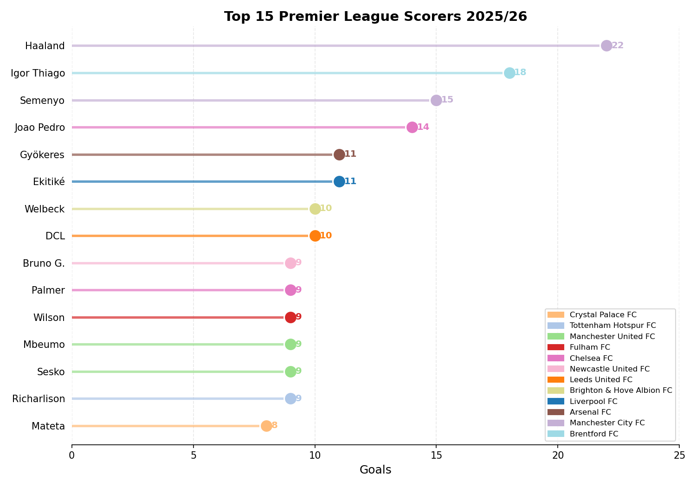
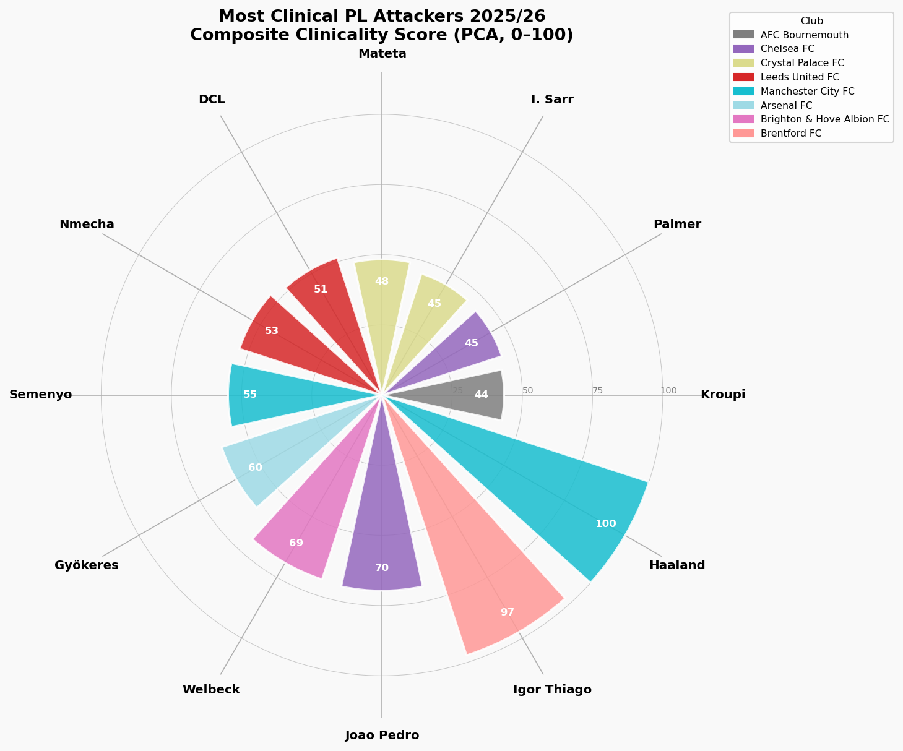

```{=html}
<div class="hero-banner">

  <!-- YouTube video background -->
  <iframe
    src="https://www.youtube.com/embed/hrO37SOX05k?autoplay=1&mute=1&loop=1&playlist=hrO37SOX05k&controls=0&showinfo=0&rel=0&modestbranding=1"
    style="position:absolute; top:50%; left:50%; width:177.78vh; min-width:100%; height:56.25vw; min-height:100%; transform:translate(-50%, -50%); border:0; z-index:0; pointer-events:none;"
    allow="autoplay; encrypted-media">
  </iframe>

  <!-- Dark gradient overlay -->
  <div style="position:absolute; inset:0; background:linear-gradient(to bottom, rgba(10,15,40,0.45) 0%, rgba(10,15,40,0.75) 100%); z-index:1;"></div>

  <!-- Text pushed to bottom -->
  <div style="position:relative; z-index:2; width:100%; text-align:center; padding:0 40px 40px 40px;">
    <h1>Beyond Goals</h1>
    <div class="subtitle">Who Are the Premier League's Most Clinical Attackers in 2025/26?</div>
    <div class="meta">Adam Wilkes &nbsp;&middot;&nbsp; 16 March 2026 &nbsp;&middot;&nbsp; BEE2041 Empirical Project</div>
  </div>

</div>
```

```{=html}
<div class="pitch-container">
  <svg class="pitch-svg" viewBox="0 0 600 380" xmlns="http://www.w3.org/2000/svg">
    <rect class="pitch-bg" width="600" height="380" rx="8"/>
    <rect class="pitch-line" x="20" y="20" width="560" height="340"/>
    <line class="pitch-line" x1="300" y1="20" x2="300" y2="360"/>
    <circle class="pitch-circle" cx="300" cy="190" r="50"/>
    <circle cx="300" cy="190" r="3" fill="rgba(255,255,255,0.6)"/>
    <rect class="pitch-line" x="20" y="110" width="100" height="160"/>
    <rect class="pitch-line" x="20" y="150" width="40" height="80"/>
    <rect class="pitch-line" x="480" y="110" width="100" height="160"/>
    <rect class="pitch-line" x="540" y="150" width="40" height="80"/>
    <circle cx="80" cy="190" r="3" fill="rgba(255,255,255,0.6)"/>
    <circle cx="520" cy="190" r="3" fill="rgba(255,255,255,0.6)"/>
    <circle class="shot-dot" cx="95" cy="175" r="7" fill="#f5c842"/>
    <circle class="shot-dot" cx="88" cy="195" r="7" fill="#f5c842"/>
    <circle class="shot-dot" cx="100" cy="210" r="7" fill="#f5c842"/>
    <circle class="shot-dot" cx="110" cy="183" r="7" fill="#f5c842"/>
    <circle class="shot-dot" cx="92" cy="200" r="7" fill="#f5c842"/>
    <circle class="shot-dot" cx="130" cy="160" r="7" fill="#e94560"/>
    <circle class="shot-dot" cx="145" cy="185" r="7" fill="#e94560"/>
    <circle class="shot-dot" cx="118" cy="205" r="7" fill="#e94560"/>
    <circle class="shot-dot" cx="160" cy="175" r="7" fill="#e94560"/>
    <circle class="shot-dot" cx="135" cy="215" r="7" fill="#e94560"/>
    <circle class="shot-dot" cx="175" cy="170" r="7" fill="#3d85c8"/>
    <circle class="shot-dot" cx="165" cy="195" r="7" fill="#3d85c8"/>
    <circle class="shot-dot" cx="180" cy="210" r="7" fill="#3d85c8"/>
    <circle class="shot-dot" cx="155" cy="185" r="7" fill="#3d85c8"/>
    <circle class="shot-dot" cx="200" cy="165" r="7" fill="#27ae60"/>
    <circle class="shot-dot" cx="185" cy="190" r="7" fill="#27ae60"/>
    <circle class="shot-dot" cx="210" cy="200" r="7" fill="#27ae60"/>
    <circle class="shot-dot" cx="195" cy="215" r="7" fill="#27ae60"/>
    <circle class="shot-dot" cx="230" cy="155" r="6" fill="rgba(255,255,255,0.4)"/>
    <circle class="shot-dot" cx="220" cy="180" r="6" fill="rgba(255,255,255,0.4)"/>
    <circle class="shot-dot" cx="240" cy="200" r="6" fill="rgba(255,255,255,0.4)"/>
    <circle class="shot-dot" cx="215" cy="215" r="6" fill="rgba(255,255,255,0.4)"/>
    <circle class="shot-dot" cx="250" cy="170" r="6" fill="rgba(255,255,255,0.4)"/>
    <circle class="shot-dot" cx="235" cy="195" r="6" fill="rgba(255,255,255,0.4)"/>
    <circle class="shot-dot" cx="260" cy="185" r="6" fill="rgba(255,255,255,0.4)"/>
    <circle class="shot-dot" cx="245" cy="210" r="6" fill="rgba(255,255,255,0.4)"/>
  </svg>
  <div style="display:flex; gap:16px; justify-content:center; flex-wrap:wrap; margin-top:10px; font-size:0.78em; color:#555;">
    <span><svg width="12" height="12"><circle cx="6" cy="6" r="5" fill="#f5c842"/></svg> Haaland</span>
    <span><svg width="12" height="12"><circle cx="6" cy="6" r="5" fill="#e94560"/></svg> Igor Thiago</span>
    <span><svg width="12" height="12"><circle cx="6" cy="6" r="5" fill="#3d85c8"/></svg> Gyokeres</span>
    <span><svg width="12" height="12"><circle cx="6" cy="6" r="5" fill="#27ae60"/></svg> Joao Pedro</span>
    <span><svg width="12" height="12"><circle cx="6" cy="6" r="5" fill="rgba(100,100,100,0.5)"/></svg> Others</span>
  </div>
</div>
```


## Introduction

Football analytics has transformed how clubs, broadcasters, and fans understand the game. Yet for all the sophistication of modern data science, the most common measure of an attacker's quality remains the simplest one: how many goals have they scored? This blog argues that is the wrong question; using data from one of the world's leading football analytics platforms to ask a better one.

The practical motivation is straightforward. Premier League clubs routinely spend tens of millions on attacking players, and the difference between a striker who scores because they get excellent chances and one who scores despite getting difficult chances is worth this money. A player whose 15-goal tally is entirely explained by shot volume and chance quality is fundamentally different, and less valuable, than one whose 12 goals reflect genuine finishing superiority. This analysis uses both descriptive statistics and a double machine learning causal model to separate those two players, identify who the Premier League's most genuinely clinical attackers are in 2025/26, and test whether finishing ability is a real, causal driver of output - or simply a reflection of the chances a team creates. 

```{=html}
<div class="stat-cards">
  <div class="stat-card">
    <div class="number" data-target="582">0</div>
    <div class="label">PL Players Scraped</div>
  </div>
  <div class="stat-card">
    <div class="number" data-target="6">0</div>
    <div class="label">Key Metrics</div>
  </div>
  <div class="stat-card">
    <div class="number" data-target="6">0</div>
    <div class="label">Visualisations</div>
  </div>
</div>
<hr class="section-divider">
```

## The Data

Opta has tracked every touch, shot, and chance creation event in professional football for over two decades. Their expected goals (xG) model is built on millions of historical shots, accounting for location, body part, and match context. This making it widely regarded as the gold standard for quantifying chance quality.

Several cleaning steps were applied: players with fewer than 5 PL goals were excluded, those with missing xG values were removed, and defenders/goalkeepers filtered out using Opta's positional classifications. This reduces the dataset from 582 players to 54 qualifying attackers.

```{=html}
<div class="metric-grid">
  <div class="metric-pill">
    <div class="icon"></div>
    <div><div class="metric-name">Goals</div><div class="metric-desc">Total goals scored in the season</div></div>
  </div>
  <div class="metric-pill">
    <div class="icon"></div>
    <div><div class="metric-name">xG (Expected Goals)</div><div class="metric-desc">Probability of each shot scoring, summed across all shots</div></div>
  </div>
  <div class="metric-pill">
    <div class="icon"></div>
    <div><div class="metric-name">Goals vs xG</div><div class="metric-desc">How many more (or fewer) goals than expected</div></div>
  </div>
  <div class="metric-pill">
    <div class="icon"></div>
    <div><div class="metric-name">Shot Conversion %</div><div class="metric-desc">Percentage of shots that resulted in a goal</div></div>
  </div>
  <div class="metric-pill">
    <div class="icon"></div>
    <div><div class="metric-name">xG per Shot</div><div class="metric-desc">Average quality of chances a player takes</div></div>
  </div>
  <div class="metric-pill">
    <div class="icon"></div>
    <div><div class="metric-name">Minutes per Goal</div><div class="metric-desc">How many minutes on average to score</div></div>
  </div>
</div>
<hr class="section-divider">
```

## Who's Scoring the Most?

The obvious starting point -- who has the most goals so far in 2025/26? This gives us the baseline before we dig into the more nuanced metrics.

```{=html}
<div class="chart-container">
```

```{=html}
  <div class="chart-caption">Figure 1 - Top 15 Premier League scorers in 2025/26 (to March 2026), colour-coded by club</div>
</div>
<div class="insight-box">
  <p><strong>Erling Haaland</strong> leads the way with <strong>22 goals</strong>, a tally that underlines why Manchester City moved to extend his contract despite a difficult season for the club. At Brentford, <strong>Igor Thiago</strong> has quietly assembled an 18-goal campaign that has drawn attention from clubs across Europe, remarkable for a player operating behind one of the league's more modest chance-creation setups. The most intriguing story in the top five, however, is <strong>Antoine Semenyo</strong>: signed from Bournemouth by Manchester City in the January transfer window, he has hit the ground running with 15 goals in all competitions, suggesting City identified a player whose underlying numbers at Bournemouth significantly understated his potential at a higher level.</p>
</div>
<hr class="section-divider">
```

## Are They Scoring What They Should? <span class="interactive-badge">Interactive</span>

Raw goals only tell us so much. Expected Goals (xG) tells us whether a player is scoring more or fewer goals than the quality of their chances would suggest — a player above the diagonal line is outperforming their xG, a player below is leaving goals on the pitch. The xG model doesn't care about reputation or price tag; it simply asks how many goals would an average striker score from these exact chances? Hover over any point to see the full stats breakdown.

```{=html}
<div class="chart-container">
  <iframe src="output/figures/02_goals_vs_xg.html" width="100%" height="720px" frameborder="0" scrolling="no"></iframe>
  <div class="chart-caption">Figure 2 - Actual goals vs Expected Goals (xG). Points above the dashed line are outperforming expectations. Hover for full stats.</div>
</div>
<div class="insight-box amber">
  <p><strong>Haaland</strong> sits almost perfectly on the diagonal line, scoring almost exactly what his chances are worth. What makes this exceptional is not the number itself but the consistency behind it. Across Salzburg, Dortmund, and Manchester City, he has tracked his xG with near-mechanical precision season after season, in different leagues, under different managers. That sustained alignment over many years is the hallmark of a truly elite finisher whose output is built on repeatable skill rather than fortune.</p>
  <p style="margin-top:12px;"><strong>Igor Thiago</strong> and <strong>Antoine Semenyo</strong> both outperform their xG meaningfully, though a sustained overperformance across multiple seasons is statistically rare.</p>
</div>
<hr class="section-divider">
```

## Quality vs Efficiency <span class="interactive-badge">Interactive</span>

This is where the analysis gets truly interesting. There is a fundamental distinction between two types of clinical striker that is often collapsed into the same discussion but deserves to be separated:

- **The Chance-Selector** takes only high-quality shots -- they have high xG per shot because they are disciplined about when and where they shoot. Their conversion rate may be modest, but every shot is a good one.
- **The Pure Finisher** takes shots from a range of positions -- including difficult ones -- but converts them at an extraordinary rate regardless. Their xG per shot may be low, but their actual conversion defies the model.

The very best attackers in the world do both simultaneously: they get into excellent positions *and* convert them at elite rates. Hover over the chart to explore where every qualifying PL attacker sits across these two dimensions.

```{=html}
<div class="chart-container">
  <iframe src="output/figures/04_xg_per_shot_vs_conversion.html" width="100%" height="650px" frameborder="0" scrolling="no"></iframe>
  <div class="chart-caption">Figure 3 - xG per Shot (chance quality) vs Shot Conversion %. Colour-coded by quadrant profile. Hover for full stats.</div>
</div>
```

### Reading the Four Quadrants

The dashed median lines divide all 54 qualifying attackers into four distinct profiles. Understanding which quadrant a player occupies tells us far more about their attacking game than their goal tally alone:

- **Top-right (Elite)** - High chance quality AND high conversion. These players get into the best positions AND finish ruthlessly. Haaland occupies this space almost uniquely among PL attackers.
- **Top-left (Pure Finishers)** - Lower chance quality but high conversion. Igor Thiago and Viktor Gyokeres sit here, suggesting they are doing something genuinely special with the chances they receive.
- **Bottom-right (Chance Merchants)** - Good positions but poor conversion. Well-positioned tactically but not making the most of their chances -- a frustrating profile for any manager.
- **Bottom-left (Struggling)** - Neither quality chances nor efficient conversion. Players here are either badly out of form, miscast in their roles, or simply not yet settled.

```{=html}
<div class="insight-box green">
  <p>The most striking finding from this chart is the position of <strong>Lukas Nmecha</strong> in the top-right elite quadrant. With an xG per shot approaching 0.30 and a conversion rate above 28%, he is not just the highest-converting player in the dataset but is doing so from the highest-quality chances of anyone in the league — a combination that is almost uniquely elite. For a midfielder rather than a natural striker, this profile is remarkable and one that mainstream coverage has almost entirely overlooked this season.</p>
  <p style="margin-top:12px;">Among the recognised forwards, <strong>Joao Pedro</strong> and <strong>Igor Thiago</strong> sit closest to true elite status, both comfortably above the median on both axes. Pedro's position is particularly telling — deployed as an orthodox centre-forward at Chelsea rather than the attacking midfielder role he occupied at Brighton, he is taking higher-quality chances and converting them at a rate that vindicates the tactical decision to push him further forward.</p>
  <p style="margin-top:12px;"><strong>Kroupi</strong> at Bournemouth is the most compelling recruitment story the chart tells. At just 19 years old, he sits in the top-left quadrant with a conversion rate around 25% despite taking chances of only modest quality — doing something genuinely special with limited service in a mid-table system not built around him. Historically, this is precisely the profile that bigger clubs identify and move for. <strong>Brian Brobbey</strong> occupies a similar position, flagging another player whose finishing ability is quietly outrunning the quality of his chance creation.</p>
  <p style="margin-top:12px;">At the other end of the story, <strong>Jean-Philippe Mateta</strong> sits just above the median horizontally but below it vertically. Crystal Palace are still creating reasonable chances for him, but his conversion rate has dropped sharply from his breakout 2023/24 season. The chart makes that regression this season impossible to ignore.</p>
</div>

<hr class="section-divider">
```

## Who Is the Most Clinical Overall?

Describing individual metrics in isolation only gets us so far. A player can lead the league in shot conversion but take so few shots that the sample is unreliable. To answer the headline question definitively, we need a single measure that combines all five metrics — goals, xG, goals vs xG, shot conversion, and xG per shot — in a way that is mathematically principled rather than arbitrarily weighted. That is what Principal Component Analysis (PCA) provides.

PCA identifies the single dimension along which the data varies most across all five metrics simultaneously. Rather than deciding in advance that conversion rate is twice as important as xG per shot, the algorithm finds the optimal weights itself based purely on the structure of the data. The first principal component captured 67% of the total variance across all five metrics, with shot conversion and goals vs xG carrying the highest weight, followed by xG per shot, total goals, and minutes per goal. Each player is projected onto that dimension and scaled to produce a Clinicality Score from 0 to 100, where 100 represents the player who dominates most completely across every finishing dimension at once.

```{=html}
<div class="chart-container">
```

```{=html}
  <div class="chart-caption">Figure 4 - Composite Clinicality Score (PCA, 0-100). Each spoke = one player; length = score.</div>
</div>
<div class="two-col">
  <div class="player-card">
    <div class="player-name">Erling Haaland</div>
    <div class="player-team">Manchester City FC</div>
    <div class="player-stat">100.0</div>
    <div class="player-label">Clinicality Score -- 22 goals, 21.57% conversion</div>
  </div>
  <div class="player-card blue">
    <div class="player-name">Igor Thiago</div>
    <div class="player-team">Brentford FC</div>
    <div class="player-stat">88.8</div>
    <div class="player-label">Clinicality Score -- 18 goals, 26.87% conversion</div>
  </div>
  <div class="player-card gold">
    <div class="player-name">Joao Pedro</div>
    <div class="player-team">Chelsea FC</div>
    <div class="player-stat">71.1</div>
    <div class="player-label">Clinicality Score -- 14 goals, 22.95% conversion</div>
  </div>
  <div class="player-card">
    <div class="player-name">Viktor Gyokeres</div>
    <div class="player-team">Arsenal FC</div>
    <div class="player-stat">59.3</div>
    <div class="player-label">Clinicality Score -- 11 goals, 25.58% conversion</div>
  </div>
</div>
<div class="insight-box">
  <p><strong>Haaland's</strong> perfect score of 100 reflects total dominance across every metric simultaneously. He leads or sits near the top in goals, xG, conversion rate, and xG per shot at the same time, a combination that is genuinely rare. <strong>Igor Thiago</strong> in second place is the more intriguing story: his 26.87% shot conversion is the highest of any player with 10 or more goals in the league, suggesting his 18-goal tally significantly <em>understates</em> his clinical ability relative to his peers.</p>
  <p style="margin-top:12px;">The most nuanced case is <strong>Viktor Gyokeres</strong>. A clinicality score of 59.3 tells an optimistic story in his underlying numbers despite sturggling after moving to Arsenal.</p>
</div>

<hr class="section-divider">
```

## Does Finishing Ability Causally Drive Goals? <span class="interactive-badge">Interactive</span>

All the analysis so far has been descriptive - it tells us who is clinical and how clinical they are. But it cannot answer the most important question for a football club making a £50 million transfer decision: **does elite finishing ability actually cause more goals, or are clinical players simply getting better chances?**

This is precisely the problem that **Double Machine Learning (Double ML)** - a causal inference technique is designed to solve. The core challenge is confounding: a player like Haaland scores a lot of goals partly because he converts well *and* partly because Manchester City create far more high-quality chances than most teams. A simple correlation between shot conversion and goals conflates these two effects entirely.

Double ML solves this through a two-stage residualisation process. In the first stage, two separate **Random Forest** models are trained: one predicts a player's shot conversion from the confounders alone (minutes played, total shots, chance quality, and position), and one predicts their goals from the same confounders. In the second stage, the residuals from both models - the parts of shot conversion and goals that cannot be explained by the confounders - are regressed against each other. The resulting coefficient is a clean, deconfounded estimate of the causal effect of finishing ability on goals.

```{=html}
<div class="metric-grid">
  <div class="metric-pill">
    <div class="icon"></div>
    <div><div class="metric-name">Treatment (T)</div><div class="metric-desc">Shot conversion % -- our measure of finishing ability</div></div>
  </div>
  <div class="metric-pill">
    <div class="icon"></div>
    <div><div class="metric-name">Outcome (Y)</div><div class="metric-desc">Goals scored -- what we want to explain</div></div>
  </div>
  <div class="metric-pill">
    <div class="icon"></div>
    <div><div class="metric-name">Confounders (W)</div><div class="metric-desc">Minutes played, shots taken, xG per shot, position</div></div>
  </div>
  <div class="metric-pill">
    <div class="icon"></div>
    <div><div class="metric-name">Nuisance Models</div><div class="metric-desc">Random Forest (200 trees, 5-fold CV) for both stages</div></div>
  </div>
</div>
```

### The Causal Estimate

The model produces an **ATE of 0.44 goals per 1 percentage point increase in shot conversion**, with a 95% confidence interval of [0.33, 0.54] entirely above zero - confirming a genuine causal effect. In practical terms: a player whose shot conversion is 5 percentage points above the league median (15.4%) is estimated to score roughly **2.2 additional goals** purely as a result of their finishing ability, holding everything else constant. For context, Igor Thiago's conversion rate of 26.9% is 11.5 percentage points above the median - implying roughly **5 goals this season** are directly attributable to his finishing superiority alone, above and beyond the quality and volume of chances he receives.

The fact that the confidence interval excludes zero is statistically meaningful: it confirms that finishing ability has a **genuine, statistically significant causal effect on goal output** that cannot be explained away by chance quality or playing time alone.

### Counterfactual Goals

The chart below applies this causal estimate to produce **counterfactual predictions**: for each of the top 15 scorers, how many goals would the model predict if they converted at exactly the league median rate? The gap between a player's actual goals (coloured bar) and their counterfactual goals (grey bar) represents their **causal finishing advantage** - the goals directly attributable to their above- or below-average conversion.

```{=html}
<div class="chart-container">
  <iframe src="output/figures/11_causal_counterfactual.html" width="100%" height="620px" frameborder="0" scrolling="no"></iframe>
  <div class="chart-caption">Figure 6 - Actual goals (coloured) vs counterfactual goals at median conversion (grey). Green = above-median finisher; Red = below-median finisher. Hover for full stats.</div>
</div>
<div class="insight-box green">
  <p><strong>Igor Thiago</strong> emerges as the player with the largest causal finishing advantage in the dataset. The Double ML model estimates that roughly 5 of his 18 goals are directly attributable to his elite 26.9% conversion rate, over and above what his chance quality and shot volume would predict for an average finisher. For a player at Brentford, a club not built to dominate possession or create chances in volume, that causal advantage is extraordinary. It also raises the obvious question for the summer: if Thiago can produce these numbers with Brentford's chance creation, what would he produce with more?</p>
  <p style="margin-top:12px;"><strong>Hugo Ekitike</strong> and <strong>Benjamin Sesko</strong> are both new signings adapting to new clubs and new systems mid-season, and the chart reflects that. Both sit in positive green territory, suggesting their finishing ability is already adding value above what an average converter would produce from the same chances. For players still finding their feet, that is an encouraging sign rather than a disappointing one.</p>
  <p style="margin-top:12px;">The most pointed finding for Crystal Palace is the position of <strong>Jean-Philippe Mateta</strong> in red. The model estimates his actual goals fall short of what an average finisher would have scored from the same chances, meaning his conversion this season has actively cost Palace goals rather than added them. After his breakout 2023/24 campaign, the regression is sharp and measurable. Palace face a genuine decision: back Mateta to rediscover his form, or recognise that the underlying numbers now make a compelling case for cashing in while his reputation from that breakout season still holds value in the market.</p>
</div>
<hr class="section-divider">
```

## Conclusion

Erling Haaland is in a category of his own. His perfect clinicality score of 100 is not a product of volume shooting, favourable chances, or a single hot streak of form. It reflects genuine, multi-dimensional superiority across every finishing metric simultaneously, sustained over multiple seasons at multiple clubs. The causal model confirms that his goal output is built on a combination of Manchester City's elite chance creation and his own finishing ability working together. There is no statistical case for anyone else as the Premier League's most clinical attacker in 2025/26.

The most important question the data raises is whether Igor Thiago can do this again. His causal finishing advantage is the largest in the dataset, his conversion rate is the highest of any player with 10 or more goals in the league, and the Double ML model estimates that roughly 5 of his 18 goals are directly attributable to his finishing ability alone. But this is one season. Sustained outperformance of xG over multiple years is exceptionally rare, and the history of football is littered with forwards who posted one extraordinary conversion season before regressing sharply. If Thiago produces similar numbers in 2026/27, the debate about whether he belongs among the elite becomes very difficult to dismiss.

Kroupi is the pick for breakout star of the next transfer window. At just 19, he is converting chances at an elite rate from a Bournemouth side not designed to create them. That combination — age, efficiency, and output in a system that undersells him — is precisely what the data identifies before the market catches up. If the underlying numbers hold and a bigger club provides him with better service, the ceiling is genuinely high. Of all the players in this dataset, Kroupi's profile makes the strongest case for a move that the statistics justified long before the headlines did.

```{=html}
<div class="blog-footer">
  <p>Data sourced from <strong>Opta Analyst</strong> (theanalyst.com) &middot; 2025/26 season data to March 2026</p>
  <p>Analysis &amp; visualisations by <strong>Adam Wilkes</strong> &middot; Code at <a href="https://github.com/aw121110/bee2041-project">github.com/aw121110/bee2041-project</a></p>
</div>
```