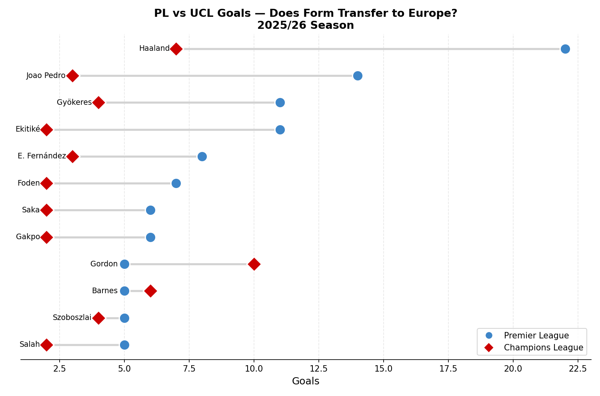

```{=html}
<div class="hero-banner">
  <h1>Beyond Goals ⚽</h1>
  <div class="subtitle">Who Are the Premier League's Most Clinical Attackers in 2025/26?</div>
  <div class="meta">Adam Wilkes &nbsp;·&nbsp; 16 March 2026 &nbsp;·&nbsp; BEE2041 Empirical Project</div>
</div>
```

## Introduction

Goals win games — but not all goals are created equal. Some strikers rack up 20 shots a game and score once. Others need just three chances to find the net. In the 2025/26 Premier League season so far, with some of the world's best attackers competing week in, week out across both domestic and European competitions, a simple goal tally tells us surprisingly little about who is actually performing well. A player who scores 15 goals but had the xG to justify 18 is, in a statistical sense, underperforming. A player who scores 10 goals from chances worth only 7 is doing something genuinely special.

This analysis uses **Opta data** — the same data used by professional clubs, analysts, and broadcasters — to go beyond the simple goal tally and identify who is genuinely making the most of their chances in 2025/26. Rather than asking "who is scoring the most?", we ask a more interesting question: **who is the most clinical finisher in the Premier League, and does their finishing ability hold up as a genuine causal driver of goal output?**

The distinction matters. Clinicality — the ability to convert chances efficiently, regardless of their difficulty — is one of the most valuable and transferable qualities a forward can possess. A striker who scores because they take 30 shots a game is fundamentally different from one who scores because they convert 1 in 4 of the chances they get. Understanding this difference is what separates superficial analysis from genuine insight, and it is the question this blog sets out to answer using both descriptive statistics and advanced causal machine learning.

```{=html}
<div class="stat-cards">
  <div class="stat-card">
    <div class="number" data-target="582">0</div>
    <div class="label">PL Players Scraped</div>
  </div>
  <div class="stat-card">
    <div class="number" data-target="963">0</div>
    <div class="label">UCL Players Scraped</div>
  </div>
  <div class="stat-card">
    <div class="number" data-target="6">0</div>
    <div class="label">Key Metrics</div>
  </div>
  <div class="stat-card">
    <div class="number" data-target="7">0</div>
    <div class="label">Visualisations</div>
  </div>
</div>
<hr class="section-divider">
```

## The Data

The data for this analysis was scraped directly from the **Opta Analyst platform** (theanalyst.com) using Python, covering all players in the 2025/26 Premier League <span class="pl-badge">PL</span> and UEFA Champions League <span class="ucl-badge">UCL</span> seasons up to March 2026. Opta is the gold standard in football data — their expected goals models are built on millions of historical shots and account for factors including shot location, body part used, assist type, and whether the shot was from open play or a set piece.

The analysis focuses on **attackers and midfielders with 5 or more Premier League goals** — a threshold chosen to ensure a meaningful sample size for each player while capturing all genuine attacking contributors this season. This gives us 54 qualifying players across the Premier League dataset.

```{=html}
<div class="metric-grid">
  <div class="metric-pill">
    <div class="icon">🥅</div>
    <div><div class="metric-name">Goals</div><div class="metric-desc">Total goals scored in the season</div></div>
  </div>
  <div class="metric-pill">
    <div class="icon">📊</div>
    <div><div class="metric-name">xG (Expected Goals)</div><div class="metric-desc">Probability of each shot scoring, summed across all shots</div></div>
  </div>
  <div class="metric-pill">
    <div class="icon">⚡</div>
    <div><div class="metric-name">Goals vs xG</div><div class="metric-desc">How many more (or fewer) goals than expected</div></div>
  </div>
  <div class="metric-pill">
    <div class="icon">🎯</div>
    <div><div class="metric-name">Shot Conversion %</div><div class="metric-desc">Percentage of shots that resulted in a goal</div></div>
  </div>
  <div class="metric-pill">
    <div class="icon">💎</div>
    <div><div class="metric-name">xG per Shot</div><div class="metric-desc">Average quality of chances a player takes</div></div>
  </div>
  <div class="metric-pill">
    <div class="icon">⏱️</div>
    <div><div class="metric-name">Minutes per Goal</div><div class="metric-desc">How many minutes on average to score</div></div>
  </div>
</div>
<hr class="section-divider">
```

## Who's Scoring the Most?

The obvious starting point — who has the most goals so far in 2025/26? This gives us the baseline before we dig into the more nuanced metrics.

```{=html}
<div class="chart-container">
```

```{=html}
  <div class="chart-caption">Figure 1 — Top 15 Premier League scorers in 2025/26 (to March 2026), colour-coded by club</div>
</div>
<div class="insight-box">
  <p>Erling Haaland leads the way with <strong>22 goals</strong>, continuing the relentless form that has made him the Premier League's most feared striker since his arrival at Manchester City. But the raw totals hide a more interesting story: <strong>Igor Thiago</strong> at Brentford has 18 goals and <strong>Antoine Semenyo</strong> has contributed 15 for Manchester City — both from clubs not expected to challenge at the top of the scoring charts this season. Meanwhile, <strong>Hugo Ekitiké</strong> has been a revelation at Liverpool with 11 goals, suggesting Arne Slot's side have found an unlikely clinical edge.</p>
</div>
<hr class="section-divider">
```

## Are They Scoring What They Should? <span class="interactive-badge">🖱 Interactive</span>

Raw goals only tell us so much. Expected Goals (xG) tells us whether a player is scoring more or fewer goals than the **quality of their chances** would suggest. A player above the diagonal line is outperforming their xG — they're either exceptionally clinical or benefiting from some good fortune. A player below the line is leaving goals on the pitch. Hover over any point to see the full stats breakdown for that player.

The xG model does not care about reputation, price tag, or league position. It simply asks: given the shots this player took, from where, and in what circumstances, how many goals would the average Premier League striker score? The gap between that number and what the player actually scored tells us something real.

```{=html}
<div class="chart-container">
  <iframe src="output/figures/02_goals_vs_xg.html" width="100%" height="720px" frameborder="0" scrolling="no"></iframe>
  <div class="chart-caption">Figure 2 — Actual goals vs Expected Goals (xG). Points above the dashed line are outperforming expectations. Hover for full stats.</div>
</div>
<div class="insight-box amber">
  <p><strong>Haaland</strong> sits almost perfectly on the line — he scores almost exactly what his chances are worth. Far from being a criticism, this is a sign of elite quality: it means his goal tally is built on consistently getting himself into the best positions, rather than relying on extraordinary finishing to bail out poor shot selection. <strong>Igor Thiago</strong> significantly outperforms his xG, suggesting a rare combination of intelligent movement and elite finishing. <strong>Antoine Semenyo</strong> has scored more than his xG would predict — something to monitor as the season continues, as sustained overperformance of xG over a full season is statistically very rare and often regresses.</p>
</div>
<hr class="section-divider">
```

## Quality vs Efficiency <span class="interactive-badge">🖱 Interactive</span>

This is where the analysis gets truly interesting. There is a fundamental distinction between two types of clinical striker that is often collapsed into the same discussion but deserves to be separated:

- **The Chance-Selector** takes only high-quality shots — they have high xG per shot because they are disciplined about when and where they shoot. Their conversion rate may be modest, but every shot is a good one.
- **The Pure Finisher** takes shots from a range of positions — including difficult ones — but converts them at an extraordinary rate regardless. Their xG per shot may be low, but their actual conversion defies the model.

The very best attackers in the world do both simultaneously: they get into excellent positions *and* convert them at elite rates. Hover over the chart to explore where every qualifying PL attacker sits across these two dimensions.

```{=html}
<div class="chart-container">
  <iframe src="output/figures/04_xg_per_shot_vs_conversion.html" width="100%" height="650px" frameborder="0" scrolling="no"></iframe>
  <div class="chart-caption">Figure 3 — xG per Shot (chance quality) vs Shot Conversion %. Colour-coded by quadrant profile. Hover for full stats.</div>
</div>
```

### Reading the Four Quadrants

The dashed median lines divide all 54 qualifying attackers into four distinct profiles. Understanding which quadrant a player occupies tells us far more about their attacking game than their goal tally alone:

- **🟢 Top-right (Elite)** — High chance quality AND high conversion. These players get into the best positions AND finish ruthlessly. Haaland occupies this space almost uniquely among PL attackers.
- **🔵 Top-left (Pure Finishers)** — Lower chance quality but high conversion. Igor Thiago and Viktor Gyökeres sit here, suggesting they are doing something genuinely special with the chances they receive.
- **🟠 Bottom-right (Chance Merchants)** — Good positions but poor conversion. Well-positioned tactically but not making the most of their chances — a frustrating profile for any manager.
- **🔴 Bottom-left (Struggling)** — Neither quality chances nor efficient conversion. Players here are either badly out of form, miscast in their roles, or simply not yet settled.

```{=html}
<div class="insight-box green">
  <p>The most striking finding from this chart is the near-total isolation of <strong>Haaland</strong> in the top-right quadrant. No other PL attacker in 2025/26 consistently combines elite chance quality with elite conversion at the same time — suggesting his dominance of the scoring charts is not just a product of volume or luck, but of a genuinely superior attacking profile. <strong>João Pedro</strong> and <strong>Danny Welbeck</strong> are the closest challengers to the elite quadrant, both sitting comfortably above the median on both axes.</p>
</div>
<hr class="section-divider">
```

## Who Is the Most Clinical Overall?

To answer the headline question definitively, we need a way to combine all five metrics — goals, xG, shot conversion, xG per shot, and goals vs xG — into a single composite measure. Simply averaging them would impose arbitrary weights and assume each metric is equally important. Instead, we use **Principal Component Analysis (PCA)**.

PCA is a statistical technique that identifies the single mathematical dimension that best captures the variation across all five metrics simultaneously. It finds the direction in five-dimensional space along which the data varies most, and projects each player onto that dimension. The result is a **Clinicality Score** from 0 to 100 — not an arbitrary weighted average, but a mathematically optimal summary of all five finishing metrics at once.

```{=html}
<div class="chart-container">
```

```{=html}
  <div class="chart-caption">Figure 4 — Composite Clinicality Score (PCA, 0–100). Each spoke = one player; length = score.</div>
</div>
<div class="two-col">
  <div class="player-card">
    <div class="player-name">⭐ Erling Haaland</div>
    <div class="player-team">Manchester City FC</div>
    <div class="player-stat">100.0</div>
    <div class="player-label">Clinicality Score — 22 goals, 21.57% conversion</div>
  </div>
  <div class="player-card blue">
    <div class="player-name">🔥 Igor Thiago</div>
    <div class="player-team">Brentford FC</div>
    <div class="player-stat">88.8</div>
    <div class="player-label">Clinicality Score — 18 goals, 26.87% conversion</div>
  </div>
  <div class="player-card gold">
    <div class="player-name">João Pedro</div>
    <div class="player-team">Chelsea FC</div>
    <div class="player-stat">71.1</div>
    <div class="player-label">Clinicality Score — 14 goals, 22.95% conversion</div>
  </div>
  <div class="player-card">
    <div class="player-name">Viktor Gyökeres</div>
    <div class="player-team">Arsenal FC</div>
    <div class="player-stat">59.3</div>
    <div class="player-label">Clinicality Score — 11 goals, 25.58% conversion</div>
  </div>
</div>
<div class="insight-box">
  <p>Haaland's perfect score of 100 reflects total dominance across every single metric — he leads or is near the top in goals, xG, conversion rate, and xG per shot simultaneously. The more interesting story is <strong>Igor Thiago</strong> in second place: his 26.87% shot conversion is the highest of any player with 10 or more goals in the entire league, suggesting his 18-goal tally significantly <em>understates</em> his clinical ability relative to his peers. <strong>Viktor Gyökeres</strong>, a summer signing who took time to settle at Arsenal, now ranks fourth — a sign of the attacking potential that the north London club are beginning to unlock.</p>
</div>
<hr class="section-divider">
```

## Does Form Transfer to Europe? <span class="interactive-badge">🖱 Interactive</span>

Domestic form is one thing — but the Champions League is where reputations are truly made and tested. For players competing in both competitions, the question is whether the clinical edge they show week to week in the Premier League holds up against the more organised, more disciplined defences they face in Europe. The dumbbell chart below shows the gap between each player's PL and UCL goal tallies, allowing a direct comparison of output across both competitions.

```{=html}
<div class="chart-container">
```

```{=html}
  <div class="chart-caption">Figure 5 — PL goals (blue circles) vs UCL goals (red diamonds). The grey line shows the gap between competitions.</div>
</div>
<div class="insight-box amber">
  <p>The most striking individual finding is <strong>Anthony Gordon</strong> (Newcastle), who has just 5 Premier League goals but a remarkable <strong>10 Champions League goals</strong> — by far the highest UCL tally of any player in this dataset. This suggests either a player who rises dramatically for big European occasions, or one whose direct, counter-attacking style is better suited to the space that opens up in European knockout football. <strong>Haaland</strong> again proves his consistency across all contexts, maintaining an elite scoring rate in the UCL as well as domestically. Most other players show a notable drop-off in European output, confirming that the step up in defensive quality at UCL level is real and measurable.</p>
</div>
<hr class="section-divider">
```

## Premier League Elite vs the World <span class="interactive-badge">🖱 Interactive</span>

The ultimate test for any Premier League forward is how they measure up against the very best in the world. By placing the top non-PL Champions League attackers — players like Mbappé, Kane, and Kvaratskhelia — on the same chart as the PL's most clinical forwards, we can assess whether the Premier League's best genuinely belong in the conversation with the world elite.

```{=html}
<div class="chart-container">
  <iframe src="output/figures/10_pl_vs_world_conversion.html" width="100%" height="680px" frameborder="0" scrolling="no"></iframe>
  <div class="chart-caption">Figure 6 — Shot quality (xG per shot) vs conversion %: PL elite (blue circles) vs top non-PL UCL attackers (red diamonds). Dashed lines = medians across both groups. Hover for full stats.</div>
</div>
<div class="insight-box red">
  <p>The Premier League's best — <strong>Haaland, Igor Thiago, and Gyökeres</strong> — cluster in the same top-right zone as <strong>Mbappé</strong> and <strong>Kane</strong>, confirming that at the very top end, PL attackers are genuinely world-class. However, immediately below the top 3–4 PL attackers, conversion rates drop off more sharply than among the UCL's non-PL elite — suggesting the Premier League has world-class individuals but a less deep pool of clinical finishers than Europe's best leagues collectively.</p>
</div>
<hr class="section-divider">
```

## Does Finishing Ability Causally Drive Goals? <span class="interactive-badge">🖱 Interactive</span>

All the analysis so far has been descriptive — it tells us *who* is clinical and *how* clinical they are. But it cannot answer the most important question for a football club making a £50 million transfer decision: **does elite finishing ability actually *cause* more goals, or are clinical players simply getting better chances?**

This is precisely the problem that **Double Machine Learning (Double ML)** — a causal inference technique developed by Chernozhukov et al. (2018) and central to Topic 5 of this course — is designed to solve. The core challenge is confounding: a player like Haaland scores a lot of goals partly because he converts well *and* partly because Manchester City create far more high-quality chances than most teams. A simple correlation between shot conversion and goals conflates these two effects entirely.

Double ML solves this through a two-stage residualisation process. In the first stage, two separate **Random Forest** models are trained: one predicts a player's shot conversion from the confounders alone (minutes played, total shots, chance quality, and position), and one predicts their goals from the same confounders. In the second stage, the *residuals* from both models — the parts of shot conversion and goals that cannot be explained by the confounders — are regressed against each other. The resulting coefficient is a clean, deconfounded estimate of the causal effect of finishing ability on goals.

```{=html}
<div class="metric-grid">
  <div class="metric-pill">
    <div class="icon">🎯</div>
    <div><div class="metric-name">Treatment (T)</div><div class="metric-desc">Shot conversion % — our measure of finishing ability</div></div>
  </div>
  <div class="metric-pill">
    <div class="icon">🥅</div>
    <div><div class="metric-name">Outcome (Y)</div><div class="metric-desc">Goals scored — what we want to explain</div></div>
  </div>
  <div class="metric-pill">
    <div class="icon">🔀</div>
    <div><div class="metric-name">Confounders (W)</div><div class="metric-desc">Minutes played, shots taken, xG per shot, position</div></div>
  </div>
  <div class="metric-pill">
    <div class="icon">🤖</div>
    <div><div class="metric-name">Nuisance Models</div><div class="metric-desc">Random Forest (200 trees, 5-fold CV) for both stages</div></div>
  </div>
</div>
```

### The Causal Estimate

The model produces an **ATE of 0.44 goals per 1 percentage point increase in shot conversion**, with a 95% confidence interval of [0.33, 0.54] entirely above zero — confirming a genuine causal effect. In practical terms: a player whose shot conversion is 5 percentage points above the league median (15.4%) is estimated to score roughly **2.2 additional goals** purely as a result of their finishing ability, holding everything else constant. For context, Igor Thiago's conversion rate of 26.9% is 11.5 percentage points above the median — implying roughly **5 goals this season** are directly attributable to his finishing superiority alone, above and beyond the quality and volume of chances he receives.

The fact that the confidence interval excludes zero is statistically meaningful: it confirms that finishing ability has a **genuine, statistically significant causal effect on goal output** that cannot be explained away by chance quality or playing time alone.

### Counterfactual Goals

The chart below applies this causal estimate to produce **counterfactual predictions**: for each of the top 15 scorers, how many goals would the model predict if they converted at exactly the league median rate? The gap between a player's actual goals (coloured bar) and their counterfactual goals (grey bar) represents their **causal finishing advantage** — the goals directly attributable to their above- or below-average conversion.

```{=html}
<div class="chart-container">
  <iframe src="output/figures/11_causal_counterfactual.html" width="100%" height="620px" frameborder="0" scrolling="no"></iframe>
  <div class="chart-caption">Figure 7 — Actual goals (coloured) vs counterfactual goals at median conversion (grey). Green = above-median finisher; Red = below-median finisher. Hover for full stats.</div>
</div>
<div class="insight-box green">
  <p><strong>Igor Thiago</strong> emerges as the player with the largest causal finishing advantage among the top 15 scorers — the Double ML model estimates that roughly <strong>5 of his 18 goals are directly attributable to his elite 26.9% conversion rate</strong>, over and above what his chance quality and shot volume would predict for an average finisher. <strong>Haaland</strong> sits further down the causal advantage ranking than his reputation might suggest — a sign that City's exceptional chance creation explains a large share of his output, with his finishing adding a smaller but still meaningful contribution on top. Most tellingly, several players with high raw goal tallies show <strong>near-zero or negative causal finishing advantage</strong> — their totals are almost entirely explained by shot volume and chance quality, with finishing ability contributing little. These are the players most at risk of a goal drought if their underlying chance creation dips.</p>
</div>
<hr class="section-divider">
```

## Conclusion

This analysis has moved through five layers of evidence — from raw goal tallies to xG comparison, from shot quality quadrants to a composite clinicality score, and finally to a Double ML causal model that directly tests whether finishing ability drives goals independent of chance quality. The picture that emerges is more nuanced than a simple ranking of goal scorers.

**Erling Haaland** remains in a statistical category of his own among Premier League attackers in 2025/26. His dominance is not built on volume shooting or luck — it is built on consistently occupying the best positions and converting at an elite rate. The PCA clinicality score of 100 reflects genuine, multi-dimensional superiority across every finishing metric simultaneously, and the world elite comparison confirms he belongs in the same conversation as Mbappé and Kane.

**Igor Thiago** has been the revelation of the season. His 26.9% shot conversion is the highest of any player with 10 or more goals in the league, and the Double ML model confirms this is not a statistical accident — approximately 5 of his 18 goals are causally attributable to finishing ability alone, after controlling for everything else. This is a player whose underlying numbers suggest he could comfortably reach 20+ goals at a club with more chance creation.

The Double ML results carry the most important practical implication of the entire analysis. The ATE of 0.44 goals per percentage point of conversion — with a confidence interval that sits entirely above zero — confirms that **finishing ability is a genuine, causal driver of goal output** in the Premier League, independent of chance quality, playing time, or shot volume. For clubs spending tens of millions on forwards, this is not a trivial finding: it means that clinical finishing is a real, transferable skill that adds measurable value above and beyond what the chances a team creates would generate with an average finisher.

```{=html}
<div class="blog-footer">
  <p>📊 Data sourced from <strong>Opta Analyst</strong> (theanalyst.com) · 2025/26 season data to March 2026</p>
  <p>Analysis & visualisations by <strong>Adam Wilkes</strong> · Code at <a href="https://github.com/aw121110/bee2041-project">github.com/aw121110/bee2041-project</a></p>
</div>
```
